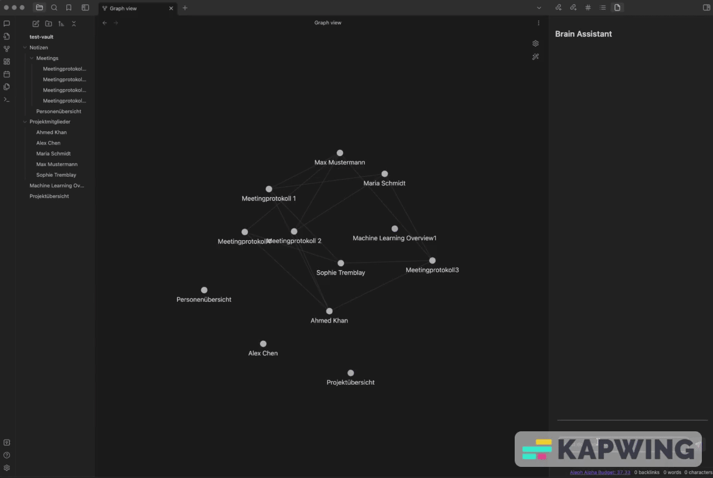

# Brain-Assistant

The Obsidian Q&A Plugin with Aleph Alpha AI Integration is a powerful tool that allows you to perform question and answer sessions using your local Obsidian.md files, enhanced by the capabilities of the Aleph Alpha AI. This plugin enhances your knowledge management workflow by enabling you to extract meaningful insights and answers from your notes.

## Demo

## Features

-   **Local Q&A:** Use your own Obsidian.md notes for Q&A sessions.
-   **Aleph Alpha AI Integration:** Leverage the Aleph Alpha AI's advanced language capabilities for improved answers.
-   **Contextual Understanding:** The AI is trained to understand the context of your questions within the notes.
-   **Multilanguage:** Aleph Alpha supports Englisch and German
-   **Budget control:** Instead of another subscription you can buy a budget of credits, see the remaining budget in your Obsidian directly.

## Why not ChatGPT?

This PlugIn is only for question and answer sessions and limited in it's capabilities to generate text for every other prompt. However, Aleph Alpha does not store any information about your requests in detail. Only metadata, like how long the request was and how much time it took, will be stored. It is a german AI manufacturer who needs to be conform with the EU Law.

## Support

